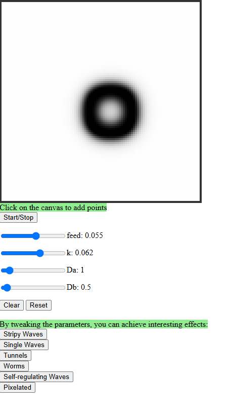
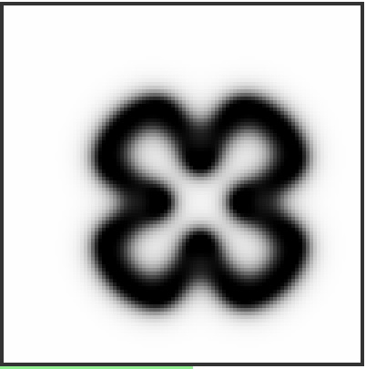
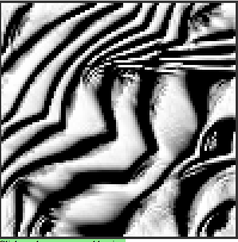
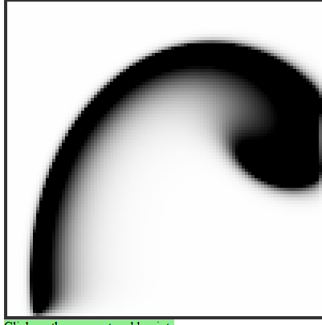

A Javascript based program that applies the Reaction Diffusion algorithm to simulate physical phenomena between two substances in a medium, one which wants to 'expand' according to some parameters, and another, the medium, which restricts said expansion.

I have implemented some presets with some parameters that generate visually interesting reactions, some of which may be the result of the specific implementation of the grid on which the algorithm takes place, or of the kernel-like matrix multiplication with another matrix operator

Variable scaling of pixel size implemented

